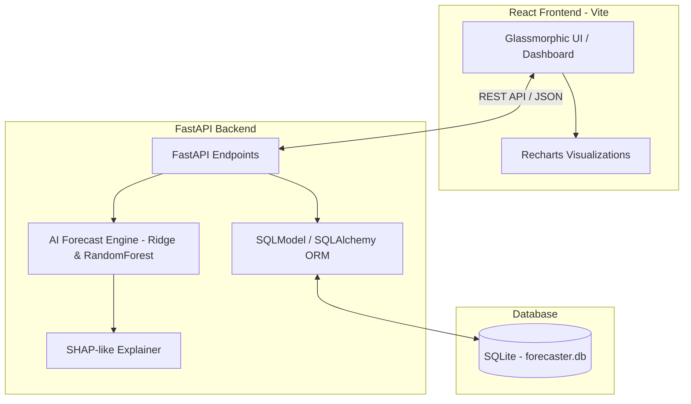

# TestForce.ai - AI Prediction API & Analytics Dashboard

TestForce.ai is a full-stack predictive quality intelligence platform designed for software testing analytics. **The model consumes weekly QA reports and predicts the next monthly testing outcomes**, training machine learning models on project trends. It features **lightweight model explainability** (local feature attributions similar to SHAP/LIME) to justify its predictions.

---

## 🏗️ Architecture

The application follows a clean decoupled client-server architecture:



*   **Frontend**: Built with React (Vite) and styled with custom Glassmorphism (Vanilla CSS). Displays historical metrics and AI predictions.
*   **Backend**: A FastAPI async server that provides REST endpoints for reports, model predictions, and DB seeding.
*   **AI Engine**: Employs an ensemble machine learning pipeline (Random Forest + Ridge Regression) trained on weekly QA reports, generating 4-week monthly forecasts with perturbation-based explainability (SHAP-like attribution).
*   **Database**: Local SQLite database managed via SQLModel ORM.

> [!NOTE]
> **Model Selection Justification (Ensemble vs LSTM):** Due to limited weekly historical data (~52 records), ensemble regression produced more stable generalization and avoided overfitting compared to deep-learning sequence models (like LSTMs).

---

## 🚀 Quick Start Guide

### Setup Backend:
1. Navigate to the backend directory:
   ```bash
   cd backend
   ```
2. Create and activate a Python virtual environment:
   ```bash
   python -m venv .venv
   .venv\Scripts\activate  # On Linux/macOS: source .venv/bin/activate
   ```
3. Install the required dependencies:
   ```bash
   pip install -r requirements.txt
   ```
4. Start the FastAPI backend server:
   ```bash
   python main.py
   ```
   *The backend server runs at `http://127.0.0.1:8000`. Swagger API docs are available at `http://127.0.0.1:8000/docs`.*

### Setup Frontend:
1. Open a new terminal and navigate to the frontend directory:
   ```bash
   cd frontend
   ```
2. Install dependencies:
   ```bash
   npm install
   ```
3. Run the development server:
   ```bash
   npm run dev
   ```
   *Open your browser and navigate to `http://localhost:5173` to access the application dashboard.*

---

## 🧪 Verification & Testing

### Backend Unit Tests
To run the automated tests validating API routing, database transactions, seeding, and forecasting calculations:
```bash
cd backend
.venv\Scripts\activate
pytest test_api.py
```

### Frontend Compilation
Verify that the React production bundle builds without any errors or warnings:
```bash
cd frontend
npm run build
```

---

## 🛠️ Tech Stack & Technologies

*   **Programming Languages:** Python, JavaScript
*   **Backend Framework:** FastAPI, Uvicorn, SQLModel (SQLAlchemy & Pydantic)
*   **Machine Learning:** Pandas, NumPy, scikit-learn, Perturbation Explainability (SHAP-like)
*   **Database:** SQLite (Local database file `forecaster.db`)
*   **Frontend:** React (Vite), Recharts, Lucide Icons, Vanilla CSS (Glassmorphism design system)
*   **Testing:** PyTest, HTTPX
